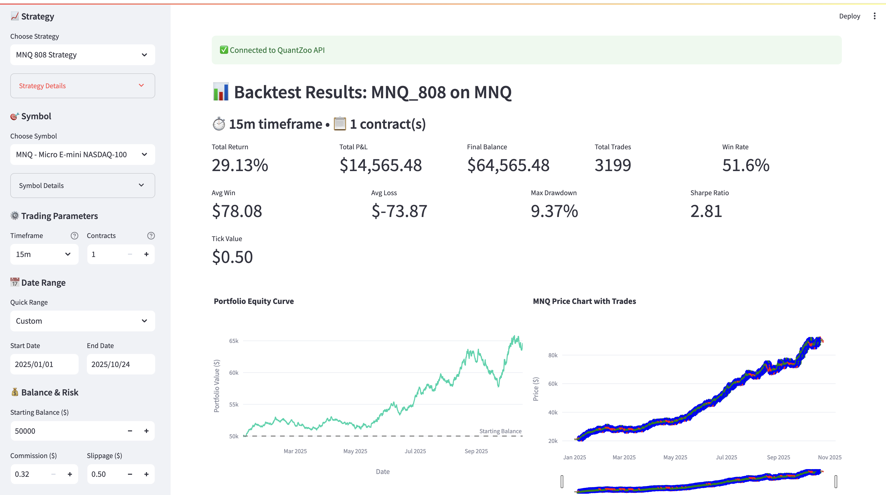

# QuantZoo

**Production-Grade Trading Framework: Backtesting, Machine Learning, Live Trading, and Risk Management**



<div align="center">

**QuantZoo: Production Trading Framework with ML & Live Execution**

_Open-source backtesting, deep learning integration, live broker connectors, and enterprise-grade risk management._

[](https://github.com/ronnielgandhe/quantzoo/actions/workflows/ci.yml)
[](https://www.python.org/downloads/release/python-3110/)
[](LICENSE)
[](https://pytorch.org/)
[](https://huggingface.co/)
[](https://www.docker.com/)
[](https://share.streamlit.io/ronnielgandhe/quantzoo/apps/streamlit_dashboard/app.py)

</div>

---

## 🎯 What is QuantZoo?

QuantZoo is a **comprehensive trading system framework** designed for quants, researchers, and systematic traders. It combines:

🔬 **Research-Grade Backtesting** - No look-ahead bias, realistic fees/slippage, walk-forward validation  
🧠 **Machine Learning Integration** - Hybrid transformers, news sentiment, explainable AI with Hugging Face  
📊 **Live Trading (Safe)** - Paper & live broker connectors (Alpaca, Interactive Brokers) with kill switches  
⚡ **Real-Time Streaming** - FastAPI backend, Streamlit dashboards, event-driven architecture  
🛡️ **Enterprise Risk Management** - VaR, Expected Shortfall, regime detection, monitoring stack  
🐳 **Production Ready** - Docker, CI/CD, Prometheus/Grafana, comprehensive documentation

---

## 🚀 Quick Start

### Installation

```bash
git clone https://github.com/ronnielgandhe/quantzoo.git
cd quantzoo
pip install -e ".[dev,ml]"  # Install all features
```

### 1. Run a Backtest (30 seconds)

```bash
# Backtest MNQ 808 strategy on 15-minute futures data
qz run -c configs/mnq_808.yaml -s 42
qz report -r <run_id>
```

### 2. Train a Machine Learning Model (5 minutes)

```bash
# Generate sample news+price data
python scripts/generate_sample_data.py

# Train hybrid transformer model
python ml/train_transformer.py --config configs/example_transformer.yaml

# Check generated model card
cat artifacts/models/news_price_hybrid_v1/model_card.md
```

### 3. Paper Trade (Safe Testing)

```python
from connectors.brokers import PaperBroker, Order, OrderSide, OrderType

# Initialize paper broker (no real money)
broker = PaperBroker({'initial_cash': 100000, 'dry_run': True})
broker.update_market_price('AAPL', 150.0)

# Place simulated order
order = Order(symbol='AAPL', side=OrderSide.BUY, quantity=10, order_type=OrderType.MARKET)
broker.place_order(order)
```

### 4. Run Real-Time Dashboard

```bash
# Terminal 1: Start FastAPI backend
python3 -m uvicorn quantzoo.rt.api:app --host 0.0.0.0 --port 8001

# Terminal 2: Replay historical data
qz ingest-replay -p tests/data/mini_mnq_15m.csv -s MNQ --speed 5

# Terminal 3: Launch Streamlit dashboard
streamlit run apps/streamlit_dashboard/app.py

# Open http://localhost:8501 in browser
```

---

## ✨ Core Features

### 🎯 Strategy Backtesting

- **Event-Driven Engine**: Bar-by-bar replay with realistic execution
- **No Look-Ahead Bias**: All indicators tested for future data leakage
- **Fees & Slippage**: Commission models, bid-ask spread simulation
- **Walk-Forward Analysis**: Out-of-sample validation with purged K-fold
- **Portfolio Backtesting**: Multi-strategy allocation (equal weight, risk parity, vol targeting)
- **PineScript-Compatible API**: Familiar syntax for TradingView users

### 🧠 Machine Learning & AI

**NEW in 2025**: Full deep learning integration with Hugging Face ecosystem

- **Hybrid Transformer Models**: Combine news sentiment (DistilBERT) + price patterns (MLP)
- **Time-Based Splitting**: Prevent data leakage with temporal train/val/test splits
- **Model Cards**: Auto-generated documentation (dataset, metrics, limitations, explainability)
- **Evaluation Suite**: ROC AUC, calibration plots, SHAP-style feature attribution
- **Hugging Face Ready**: Export models to HF Hub with standardized cards

**Example**: Train a news+price classifier
```bash
python ml/train_transformer.py --config configs/example_transformer.yaml
# Outputs: model.pt, checkpoint.pt, metrics.json, model_card.md
```

### 📊 Live Trading & Broker Integration

**⚠️ CRITICAL SAFETY**: All connectors default to paper mode with multiple safety layers

**Supported Brokers**:
- ✅ **Paper Broker**: Simulated trading with slippage/commission models
- ✅ **Alpaca Markets**: Paper & live trading (US stocks, crypto)
- ✅ **Interactive Brokers**: Paper & live via IB Gateway (global markets)

**Safety Features**:
1. **Global Kill Switch**: Emergency stop all trading via FastAPI endpoint
2. **Environment Validation**: `QUANTZOO_ENV=production` required for live orders
3. **Two-Step Confirmation**: Live orders require explicit approval
4. **Dry-Run Default**: All connectors initialize in paper mode
5. **Comprehensive Audit Logs**: Every order, position change, safety event logged

**Kill Switch Example**:
```bash
# Emergency stop all trading
curl -X POST http://localhost:8888/kill-switch/activate \
  -H "Authorization: Bearer $SAFETY_API_TOKEN" \
  -d '{"reason": "Emergency stop", "close_positions": true}'
```

### ⚡ Real-Time Infrastructure

- **FastAPI Streaming Service**: Server-Sent Events for live data delivery
- **Provider Abstraction**: Unified interface for Alpaca, Polygon, replay providers
- **Replay Engine**: Historical data simulation at configurable speeds (1x - 100x)
- **WebSocket Support**: Real-time position, trade, signal updates
- **Streamlit Dashboards**: Interactive charts, live P&L, strategy monitoring

### 🛡️ Risk Management & Monitoring

**Advanced Risk Metrics**:
- **Historical VaR**: Value at Risk using historical simulation (95%, 99% confidence)
- **Expected Shortfall**: Conditional VaR measuring tail risk beyond VaR
- **Drawdown Analysis**: Peak-to-trough analysis with duration and recovery time
- **Performance Attribution**: Strategy-level risk contribution in portfolios
- **Regime Detection**: Market regime classification and adaptation

**Monitoring Stack**:
- **Prometheus**: Metrics collection (order counts, latency, P&L)
- **Grafana**: Visualization dashboards with alerting
- **Health Checks**: `/healthz`, `/status` endpoints for uptime monitoring
- **Docker Compose**: One-command monitoring stack deployment

```bash
# Start Prometheus + Grafana
docker-compose -f ops/docker-compose.monitor.yml up -d
open http://localhost:3000  # Grafana (admin/admin)
```

### 🐳 Production Deployment

- **Docker Images**: Multi-stage builds for inference, training, API
- **CI/CD Pipeline**: GitHub Actions with security scanning (Bandit, Safety)
- **Environment Management**: .env files, credential rotation procedures
- **RUNBOOK**: 500-line operations manual with emergency procedures
- **Pre-Commit Hooks**: Black, isort, flake8, mypy enforcement

---

## 📈 Latest Results (2025)

**MNQ_808 (15m Futures, Jan-Oct 2025)**
- Sharpe Ratio: **2.81**
- Max Drawdown: **9.37%**
- Win Rate: **51.6%**
- Total Return: **29.1%** (10 months)
- Commission: $0.32/side, Slippage: 0.5 tick

<p align="center">
  
</p>

---

## 🏗️ Architecture

```
quantzoo/
├── backtest/           # Core backtesting engine with fee/slippage simulation
├── strategies/         # Trading strategies (MNQ_808, momentum, pairs, etc.)
├── ml/                 # 🆕 Machine learning pipelines
│   ├── train_transformer.py    # Hybrid model training
│   ├── evaluate.py             # Metrics, calibration, attribution
│   ├── data/                   # News-price data loaders
│   ├── models/                 # Hybrid transformer architectures
│   └── pipelines/              # Multi-asset alignment
├── connectors/         # 🆕 Live broker integration
│   └── brokers/                # Paper, Alpaca, IBKR connectors
├── services/           # 🆕 Safety API (kill switch)
├── eval/               # Walk-forward validation, purged K-fold
├── metrics/            # Sharpe, drawdown, VaR, Expected Shortfall
├── indicators/         # No look-ahead technical indicators (ATR, RSI, MACD)
├── portfolio/          # Multi-strategy allocation and rebalancing
├── rt/                 # Real-time streaming (FastAPI, providers, replay)
├── store/              # DuckDB persistence layer
├── reports/            # Markdown + HTML report generation
├── cli/                # Command-line interface (qz commands)
├── ops/                # 🆕 Monitoring (Prometheus, Grafana, RUNBOOK)
├── tools/              # 🆕 Leaderboard export, prop firm submission
└── apps/               # Streamlit dashboards
```

**Data Flow**:
1. **Data Ingestion**: Historical CSV / Real-time providers (Alpaca, Polygon)
2. **Feature Engineering**: Technical indicators, news sentiment, ML features
3. **Signal Generation**: Strategy logic / ML model predictions
4. **Position Management**: Order placement, slippage simulation, fills
5. **Risk Controls**: Kill switch, position limits, drawdown checks
6. **Portfolio Allocation**: Capital allocation across strategies
7. **Performance Tracking**: Metrics calculation, monitoring, alerts
8. **Persistence**: DuckDB storage, audit logs, model artifacts

---

## 🧪 Testing & Validation

QuantZoo has **comprehensive test coverage** to ensure reliability:

### Automated Testing

```bash
# Run full test suite
pytest -v --cov=quantzoo

# Specific test suites
pytest tests/test_no_lookahead.py -v      # Look-ahead bias prevention
pytest tests/test_fees_slippage.py -v     # Fee/slippage accuracy
pytest tests/test_brokers.py -v           # Broker connector safety
pytest tests/test_ml_no_lookahead.py -v   # ML data leakage prevention
pytest tests/test_walkforward.py -v       # Walk-forward validation
```

### CI/CD Pipeline

GitHub Actions workflow includes:
- ✅ Unit tests (pytest)
- ✅ Type checking (mypy)
- ✅ Code formatting (black, isort)
- ✅ Linting (flake8)
- ✅ Security scanning (Bandit, Safety)
- ✅ Dependency auditing

### Safety Validation

All broker connectors tested for:
- Kill switch functionality
- Environment validation
- Order confirmation flows
- Position tracking accuracy
- Slippage application

---

## 📚 Documentation

| Document | Description |
|----------|-------------|
| [RUNBOOK.md](ops/RUNBOOK.md) | Operations manual with emergency procedures |
| [IMPLEMENTATION_SUMMARY.md](IMPLEMENTATION_SUMMARY.md) | Complete feature overview and verification commands |
| [PR_BODY.md](PR_BODY.md) | Detailed PR description for production features |
| [pr_checklist.md](pr_checklist.md) | Required approvals before production deployment |
| [model_card_template.md](docs/model_card_template.md) | ML model documentation template |
| [EXAMPLES.md](docs/EXAMPLES.md) | Strategy examples and tutorials |
| [METRICS.md](docs/METRICS.md) | Performance metrics reference |

---

## 🔐 Security & Compliance

### Credentials Management

```bash
# Create .env file (gitignored)
ALPACA_API_KEY=your_key_here
ALPACA_API_SECRET=your_secret_here
SAFETY_API_TOKEN=generate_secure_random_token
QUANTZOO_ENV=development  # NEVER set to 'production' without approval
```

### Before Production Deployment

**Required Approvals** (see `pr_checklist.md`):
- [ ] Code review by senior engineer
- [ ] Security audit
- [ ] Compliance approval
- [ ] Legal review of terms
- [ ] Risk management sign-off
- [ ] 2+ weeks paper trading validation
- [ ] Disaster recovery plan
- [ ] Insurance/liability coverage

### Credential Rotation

Rotate API keys every 90 days:
1. Generate new keys in broker portal
2. Update `.env` file
3. Restart services
4. Verify functionality
5. Revoke old keys after 24 hours

See `ops/RUNBOOK.md` for detailed procedures.

---

## 🛠️ CLI Reference

### Backtesting

```bash
# Run single strategy backtest
qz run -c configs/mnq_808.yaml -s 42

# Portfolio backtest with multiple strategies
qz run-portfolio -c configs/portfolio_example.yaml -s 42

# Walk-forward validation
qz walkforward -c configs/mnq_808.yaml -s 42 --window 252 --step 63

# Generate report
qz report -r <run_id>

# View leaderboard
qz leaderboard
```

### Real-Time

```bash
# Replay historical data
qz ingest-replay -p tests/data/mini_mnq_15m.csv -s MNQ --speed 5

# List stored runs
qz list-runs

# Clean up old runs
qz cleanup --keep 50
```

### Machine Learning

```bash
# Train model
python ml/train_transformer.py --config configs/example_transformer.yaml

# Evaluate model
python ml/evaluate.py --model artifacts/models/my_model/model.pt

# Generate leaderboard
python tools/export_leaderboard.py --input artifacts/results/ --output leaderboard.md
```

---

## 📖 Examples

### Individual Strategy Backtest

```bash
qz run -c configs/mnq_808.yaml -s 42
qz report -r <run_id>
```

### Portfolio with Risk Parity Allocation

```yaml
# configs/portfolio_example.yaml
name: "multi_strategy_portfolio"
strategies:
  - name: "MNQ808"
    config: "configs/mnq_808.yaml"
  - name: "Momentum"
    config: "configs/momentum.yaml"
    
allocation:
  method: "risk_parity"  # Equal risk contribution
  rebalance_freq: 21
```

```bash
qz run-portfolio -c configs/portfolio_example.yaml -s 42
```

### Train Hybrid Transformer

```bash
# Generate synthetic data
python scripts/generate_sample_data.py

# Train model
python ml/train_transformer.py --config configs/example_transformer.yaml

# Artifacts created:
# - artifacts/models/news_price_hybrid_v1/model.pt
# - artifacts/models/news_price_hybrid_v1/model_card.md
# - artifacts/models/news_price_hybrid_v1/metrics.json
```

### Paper Trading Test

```python
from connectors.brokers import PaperBroker, Order, OrderSide, OrderType

broker = PaperBroker({
    'initial_cash': 100000,
    'slippage_bps': 5,
    'commission_per_share': 0.005,
    'dry_run': True
})

broker.update_market_price('AAPL', 150.0)

order = Order(
    symbol='AAPL',
    side=OrderSide.BUY,
    quantity=10,
    order_type=OrderType.MARKET
)

order_id = broker.place_order(order)
positions = broker.get_positions()
print(f"Position: {positions['AAPL']}")  # Position: 10 shares @ $150.25 (with slippage)
```

---

## 🚨 Emergency Procedures

### Activate Kill Switch

```bash
# Stop all trading immediately
curl -X POST http://localhost:8888/kill-switch/activate \
  -H "Authorization: Bearer $SAFETY_API_TOKEN" \
  -d '{
    "reason": "Emergency stop - unexpected behavior",
    "close_positions": true,
    "operator": "Admin"
  }'
```

### Close All Positions

```python
from connectors.brokers import get_broker

broker = get_broker('alpaca', dry_run=True)
broker.close_all_positions()
```

### Check System Status

```bash
# API health
curl http://localhost:8001/healthz

# Safety API status
curl http://localhost:8888/status

# Monitoring dashboards
open http://localhost:3000  # Grafana
open http://localhost:9090  # Prometheus
```

See `ops/RUNBOOK.md` for complete emergency procedures.

---

## 🗺️ Roadmap

### ✅ Version 1.5 (2025) - COMPLETE

- [x] Machine learning integration (PyTorch, Hugging Face)
- [x] Hybrid transformer models (news + price)
- [x] Live broker connectors (Paper, Alpaca, IBKR)
- [x] Safety API with kill switch
- [x] Monitoring stack (Prometheus, Grafana)
- [x] Model cards and explainability
- [x] Multi-asset ML pipelines
- [x] Docker deployment
- [x] CI/CD with security scanning
- [x] Comprehensive operations documentation

### 🔜 Version 2.0 (Planned)

- [ ] Advanced order types (limit, stop, iceberg, TWAP)
- [ ] Multi-asset portfolio optimization (mean-variance, Black-Litterman)
- [ ] Reinforcement learning strategy templates
- [ ] Options pricing and Greeks calculation
- [ ] Tick-by-tick backtesting
- [ ] Cloud deployment (AWS, GCP, Azure)
- [ ] WebSocket real-time streaming
- [ ] Advanced regime detection (HMM, changepoint detection)

---

## ⚖️ Legal Disclaimer

**This software is for educational and research purposes only.**

- ❌ **NOT FINANCIAL ADVICE**: QuantZoo provides tools, not investment recommendations
- ❌ **NO GUARANTEES**: Past performance does not indicate future results
- ❌ **SUBSTANTIAL RISK**: Trading involves risk of loss and may not be suitable for all investors
- ❌ **YOUR RESPONSIBILITY**: Users are solely responsible for their trading decisions

**Before live trading**:
- Consult qualified financial advisors
- Obtain proper regulatory licenses
- Implement comprehensive risk controls
- Understand all applicable regulations
- Have legal review of terms
- Ensure adequate insurance coverage

See `pr_checklist.md` for required production approvals.

---

## 📄 License

MIT License - see [LICENSE](LICENSE) for details.

---

## 🤝 Contributing

We welcome contributions! Please follow these guidelines:

### Development Setup

```bash
git clone https://github.com/ronnielgandhe/quantzoo.git
cd quantzoo
pip install -e ".[dev,ml]"

# Run tests
pytest -v --cov=quantzoo

# Code quality checks
black quantzoo tests
isort quantzoo tests
flake8 quantzoo
mypy quantzoo --ignore-missing-imports
```

### Pull Request Process

1. Fork repository and create feature branch
2. Add tests for new functionality (minimum 90% coverage)
3. Ensure all tests pass
4. Run code quality checks (black, isort, flake8, mypy)
5. Update documentation
6. Submit PR with clear description

### Code Standards

- **Type Hints**: All functions must include type annotations
- **Docstrings**: Use Google-style docstrings
- **Testing**: Minimum 90% test coverage required
- **No Look-Ahead**: All indicators tested for future data leakage
- **Deterministic**: All randomization must use seeds
- **Safety First**: All broker code requires safety checks

See [CONTRIBUTING.md](CONTRIBUTING.md) for detailed guidelines.

---

## 👨‍💻 About

QuantZoo is built by **Ronniel Gandhe** with contributions from the open-source community.

- 🌐 Website: [quantzoo.tech](https://quantzoo.tech)
- 👔 LinkedIn: [linkedin.com/in/ronnielgandhe](https://linkedin.com/in/ronnielgandhe)
- 📧 Contact: [email](mailto:ronniel@quantzoo.tech)

---

## ⭐ Star History

If you find QuantZoo useful, please consider starring the repository!

---

## 🏷️ Topics

`quant` `trading` `backtesting` `machine-learning` `deep-learning` `pytorch` `transformers` `huggingface` `live-trading` `risk-management` `streamlit` `fastapi` `docker` `prometheus` `grafana` `fintech` `algorithmic-trading` `portfolio-management`

---

<div align="center">

**Built with Python 3.11+ • Powered by pandas, PyTorch, and ❤️**

[Documentation](docs/) • [Examples](examples/) • [Issues](https://github.com/ronnielgandhe/quantzoo/issues) • [Discussions](https://github.com/ronnielgandhe/quantzoo/discussions)

</div>
